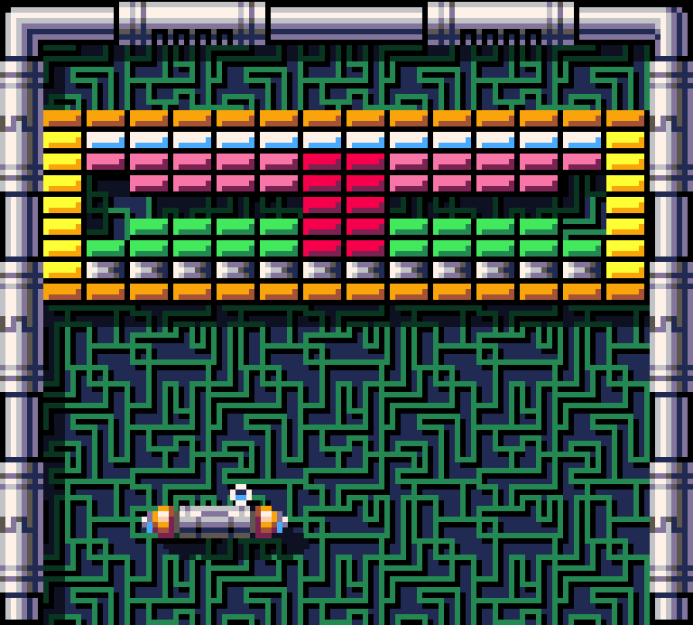

# Arkanoid

Simple copy of Arkanoid game

##  Overall info

The goal of the game is to destroy all bricks.

The game has only a few basic mechanics

To play, you must first create a level and load it.

## Installation

 - Clone/download the repository
 - Run `index.html` with the server (e.g. Live Server) 
    

## Features

- Map Creator:
    - undo/redo
    - selection negation
    - load from file
    - export to file
- Random game backgrounds
- Collision system
- Shadows

## Technologies

  
  
  

## Controls

### Map Creator:
- Select Brick - LMB
- Select area - Hold LMB
- Selection negation - Ctrl + LMB
- Menu - RMB
- Undo - Ctrl + Z
- Redo - Ctrl + Y
- Delete - Del
- Save to file - Ctrl + S
- Load data from file - Ctrl + L

### Game:
- Load data from file - Ctrl + L
- Move palette - AD / <> (Arrows)
- Start game - Space
